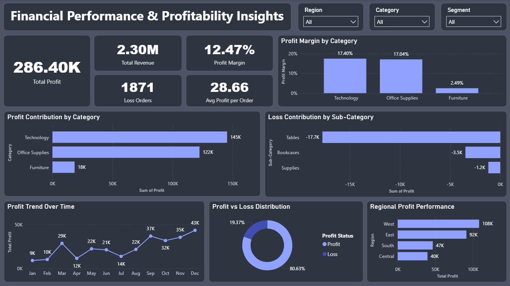

# 💰 Financial Performance & Profitability Insights Dashboard

An interactive Power BI dashboard built to analyze financial performance, profit margins, and profitability trends across product categories, sub-categories, and regions.

---

## Short Description / Purpose

This dashboard helps business leaders and finance teams track revenue, profit, and loss patterns — identifying which categories and regions are driving profitability and which sub-categories are causing losses.

---

## File Format

- `.pbix` — Power BI dashboard template (open in Power BI Desktop)
- `.csv` — Dataset used to build the dashboard
- `.png` — Preview screenshot of the final dashboard

---

## Data Source

- Dataset: Sample Superstore Dataset
- Records: 9,994 orders
- Columns: Order ID, Order Date, Ship Mode, Segment, Region, Category, Sub-Category, Product Name, Sales, Quantity, Discount, Profit
- Source: Publicly available retail analytics dataset

---

## Features / Highlights

### Business Problem
Retail businesses often struggle to identify which product categories and regions are truly profitable versus which ones are silently generating losses — especially when overall revenue looks healthy on the surface.

### Goal of the Dashboard
To deliver a clear financial analytics tool that helps stakeholders:
- Monitor total revenue, profit, and profit margin at a glance
- Identify top profit-contributing and loss-generating categories
- Analyze profit trends over time
- Compare regional profitability performance

### Walkthrough of Key Visuals

- KPI Cards — Total Profit (286.40K), Total Revenue (2.30M), Profit Margin (12.47%), Loss Orders (1,871), Avg Profit per Order (28.66)
- Profit Margin by Category (Bar Chart) — Technology leads at 17.40%, followed by Office Supplies at 17.04%, Furniture lowest at 2.49%
- Profit Contribution by Category (Horizontal Bar Chart) — Technology (145K), Office Supplies (122K), Furniture (18K)
- Loss Contribution by Sub-Category (Bar Chart) — Tables highest loss at -17.7K, followed by Bookcases (-3.5K) and Supplies (-1.2K)
- Profit Trend Over Time (Line Chart) — Monthly profit trend across the year, peaking in December at 43K
- Profit vs Loss Distribution (Donut Chart) — 80.63% orders are profitable, 19.37% are loss-making
- Regional Profit Performance (Bar Chart) — West leads with 108K, followed by East (92K), South (47K), Central (40K)
- Slicers — Filter by Region, Category, and Segment

### Business Impact & Insights

- Technology is the most profitable category — investment and inventory should be prioritized here
- Furniture has the lowest profit margin at 2.49% — pricing and discount strategy needs revision
- Tables sub-category is the biggest loss driver — discount levels should be reviewed immediately
- West region consistently outperforms all others — can serve as a benchmark for other regions
- 19.37% loss orders signal excessive discounting — a stricter discount policy could significantly improve margins

---

## Screenshots / Demos

